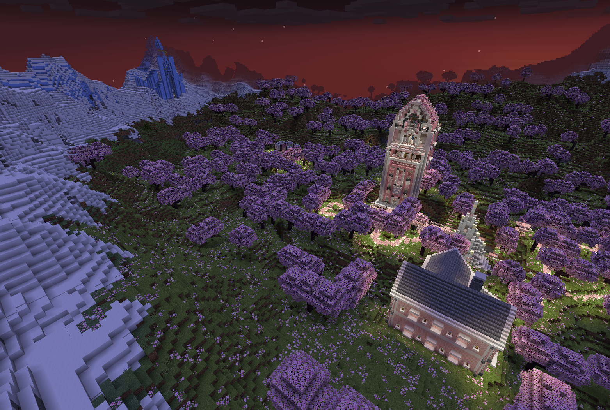
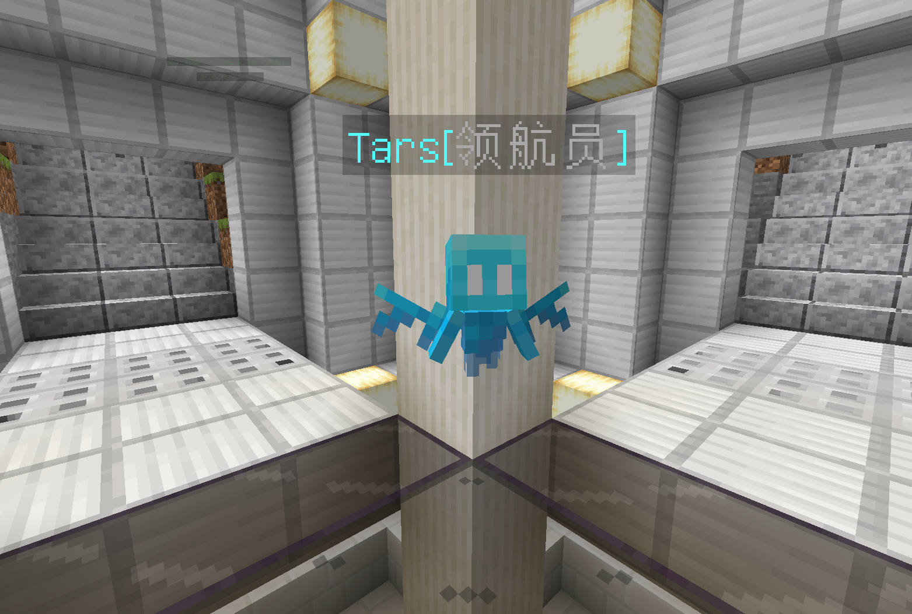
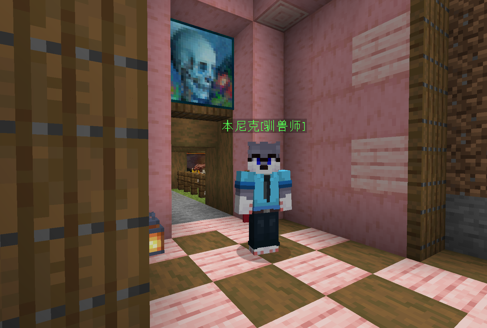

# 🗺️ 世界与地点

## 菜单-传送导航🧭

<figure><figcaption><p>世界与地点传送菜单</p></figcaption></figure>

<figure><figcaption></figcaption></figure>

## 世界（Worlds）

KeleMC 的通过空间折跃将探险家在多个世界之间来回穿梭，探险家只需要通过菜单或指令即可触发折跃。

### Space

领域号空间站停泊空间，为可勒集团通过空间改造技术在宇宙中创造的一个私有领域时空，领域号常驻于此。在探明新纪元星球后会派出探险飞船前往控制目标星球🪐，掠夺资源。

由于领域号空间站将不断扩建，来自各个纪元的资源也将会汇集于此，未来将建成商贸之都。

**指令：**

```
/mvtp space
```

<figure><figcaption><p>Space</p></figcaption></figure>

### 主世界（word-1.20）

可勒集团当前首要开发星球，探险家主要驻扎地，不断涌入的新探险家们将汇聚于此。

**指令：**

```
/mvtp world
```

```
/spawn
```

主世界还包含下界（world\_nether）维度与末地（world\_the\_end）维度，不同的维度将面临不同的挑战和资源。

<figure><figcaption><p>主世界</p></figcaption></figure>

### 冒险公会世界（ag）

可勒集团根据一次次探险开辟出的冒险世界，收集多次探险遇到的精英怪物供新探险者进行历练，历练声望与等级越高，探险的难度越低，更多内容想见👉[冒险公会](../skills/adventure-guild.md)

**指令：**

```
/ag
```

<figure><figcaption><p>冒险公会世界</p></figcaption></figure>

### 资源世界（resource world）

位于主世界星球同步轨道上的一颗伴星，有着与主世界一样的地貌和维度——资源世界（resource world）、资源下界（resource nether）、资源末地（resource end）。

根据探险家反馈，该世界有这固定脉冲重置（原因不明），以下是测定到的重置频率：

```
资源世界：48 小时
资源下界：48 小时
资源末地：168 小时（7 个地球日）
```

**指令：**

```
/rw tp
```

```
/rw tp nether
```

```
/rw tp end
```

## 地点（Warps）

### Tars 领航员

可勒集团智能领航生物机器人，目前服役于先遣队，根据先遣队已知情报汇编的指南之书可以帮助探险者快速熟悉世界。

**指令：**

```
/spawn
```

<figure><figcaption><p>Tars</p></figcaption></figure>

### 黑执事

自称来自人类地球一个叫英国的地方，他可以与探险家签订死神契约，当探险家死亡时根据契约精神，将回收探险家背包遗物，并在探险家重生之时返还之。

**指令：**

```
/warp 黑执事
```

<figure><figcaption><p>黑执事</p></figcaption></figure>

### 本尼克

一个当地人，在先遣队登陆之初，因为本尼克帮助先遣队捕捉并驯化当地生物而受到探险家们的热情欢迎。其驯养了很多生物但唯独钟爱狼狗，探险家们亲切地称呼他为兽人控。

**指令：**

```
/warp 本尼克
```

<figure><figcaption><p>本尼克</p></figcaption></figure>


（其他地点还在探明中...）
