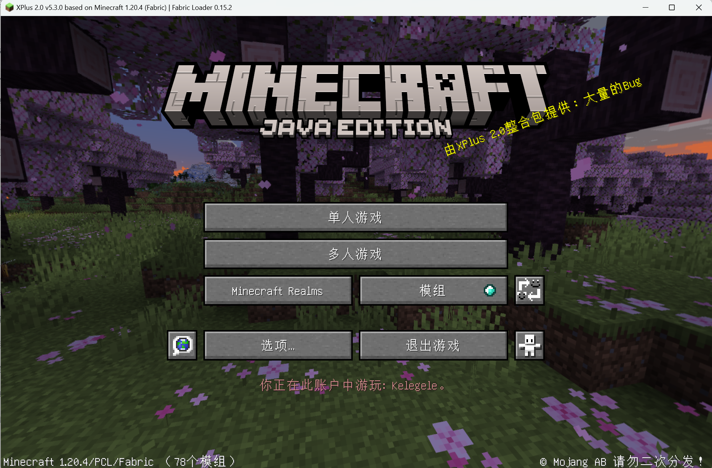
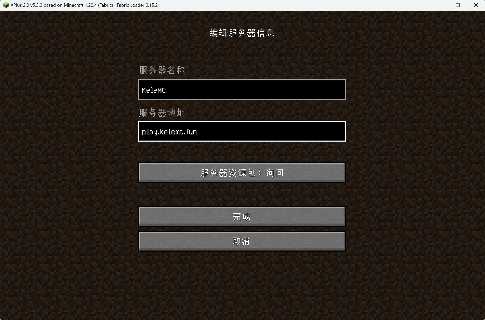

# 👉 加入游戏

本页将为你介绍如何下载并加入 KeleMC 服务器。

如果你是 Minecraft 老玩家或者已经在多人游戏摸爬滚打过，这里可能不太适合你阅读，你只需要输入 KeleMC 的游戏 IP 即可加入游戏。

服务器版本：

```
Java 1.20.4
```

服务器名称：

```
KeleMC
```

服务器地址：

```
play.kelemc.fun
```

## Minecraft 账号

在开始之前，你需要有一个 Minecraft：Java 版账号。 如果您没有 Java 版账号，则无法进入本服务器。

需要购买账号可以跳转右侧链接到官方渠道购买一个。🔗[https://www.minecraft.net/zh-hans](https://www.minecraft.net/zh-hans)&#x20;


小插曲：本服务器装有 [Gypsy](http://gypsy-mc.org/) 插件支持通过基岩版（Minecraft Bedrock Edition）账号进入，使用基岩版的小伙伴也可以用以下 IP 加入服务器。

基岩版 IP ： <mark style="background-color:yellow;">**kelemc.fun : 19132**</mark>


## 游戏启动器

Minecraft 游戏需要一个启动器进行登录账号，携带你的账号资料启动游戏，有些启动器还有些额外的功能，比如，管理模组、调整启动参数、~~把男娘图换成启动页面~~等等。有那么一些启动器可以选择：

* [官方启动器](https://www.minecraft.net/zh-hans/download)（不推荐，支持 Windows/Linux/MacOS 平台）
* [Plain Craft Launcher 2](https://afdian.net/a/LTCat?tab=feed)（推荐，简称 PCL2，支持 Windows 平台）
* [Hello Minecraft! Launcher](https://hmcl.huangyuhui.net/)（推荐，简称 HMCL，支持 Windows/Linux/MacOS 平台）
* 其他没有具体探索过的启动器：[MultiMC](https://multimc.org/)、[BakaXL](https://www.bakaxl.com/)、[X Minecraft Launcher](https://xmcl.app/zh/) 等等

安装好了启动器后，各个启动器大同小异都有这些流程：

1. 登录 Minecraft 账号
2. 下载游戏版本（<mark style="color:red;">本服务器目前为 1.20.4 版本</mark>）
3. （可选）通过整合包一键安装游戏版本+模组 Mods
4. （可选）自定义安装和配置你需要的模组 Mods，初次游玩 Minecraft 暂不建议
5. 启动游戏！

## 加入服务器

启动游戏后，会看到如下游戏主界面，若需要切换语言，可以点击这个（.png>)）按钮进行切换适合你的语言。

<figure><figcaption><p>Minecraft 启动后游戏主界面</p></figcaption></figure>

接下来，选择 **多人游戏** ，进入到如下服务器列表页面。

<figure><figcaption><p>Minecraft 多人游戏服务器列表</p></figcaption></figure>

选择 **添加服务器** ，然后复制粘贴或直接输入以下服务器 IP ，服务器名称可以命名为 KeleMC 或者任意你喜欢的自定义名称。

服务器名称：

```
KeleMC
```

服务器地址：

```
play.kelemc.fun
```

<figure><figcaption><p>编辑服务器信息</p></figcaption></figure>

确认输入无误后，点击完成✅即可添加服务器。KeleMC 就会出现在你的服务器列表。

第一次添加服务器或网络不好，可能不会马上看到服务器连接状态，此时刷新几次，或者检查一下网络🛜情况，或者检查下输入的服务器地址是否有误等等。

成功连接服务器后，即可看到如下界面，此时选择服务器后点击 **加入服务器** 开始游戏吧🎮！

<figure><figcaption><p>服务器列表</p></figcaption></figure>

